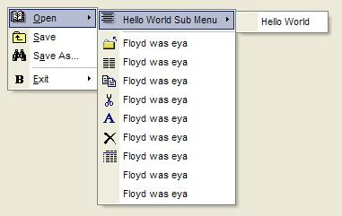



## XP Menu Control

### Description

This activeX control enables you to create those stylish flat menus first seen in Office XP, easy to use but still needs finnishing.

PLEASE VOTE.
 
### More Info
 

             |
---                |---
**Submitted On**   |2002-01-16 23:02:28
**By**             |[F Price](https://github.com/Planet-Source-Code/PSCIndex/blob/master/ByAuthor/f-price.md)
**Level**          |Advanced
**User Rating**    |4.5 (90 globes from 20 users)
**Compatibility**  |VB 6\.0
**Category**       |[OLE/ COM/ DCOM/ Active\-X](https://github.com/Planet-Source-Code/PSCIndex/blob/master/ByCategory/ole-com-dcom-active-x__1-29.md)
**World**          |[Visual Basic](https://github.com/Planet-Source-Code/PSCIndex/blob/master/ByWorld/visual-basic.md)
**Archive File**   |[XP\_Menu\_Co491491162002\.zip](https://github.com/Planet-Source-Code/f-price-xp-menu-control__1-30864/archive/master.zip)

### API Declarations

Lots...

